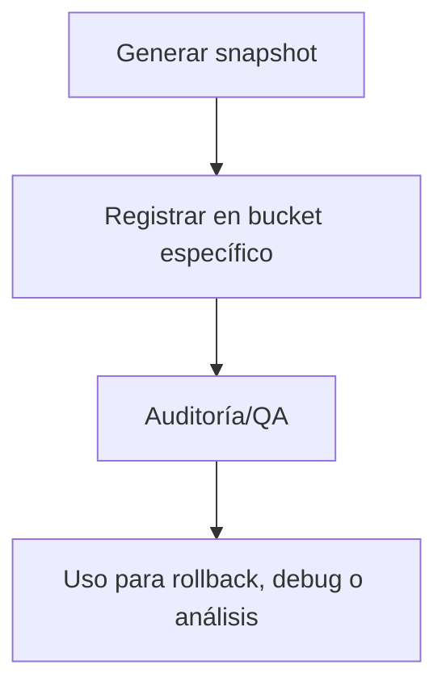

---

## file: README.md version: v3.1-2025-08-05 bucket: snapshots\_ctx blueprint: ../blueprint\_rw\_b\_platform\_v\_3\_20250803.md status: active updated: 2025-08-05 role: documentation owner: AingZ\_Platform · RwB

# [RwB] snapshots\_ctx/ — README (v3.1)

> **Tagline:** Almacén controlado de snapshots, estados de contexto y dumps de sesiones IA-humanos para trazabilidad, debug y compliance evolutiva.

---

## Índice

1. [Descripción General](#1-descripción-general)
2. [Estructura Interna](#2-estructura-interna)
3. [Cross‑References](#3-cross-references)
4. [Flujos & Workflows](#4-flujos--workflows)
5. [Compliance & Buenas Prácticas](#5-compliance--buenas-practicas)
6. [Changelog](#6-changelog)
7. [Metadatos IA](#7-metadatos-ia)

---

## 1. Descripción General

Bucket principal para almacenamiento y versionado de snapshots de contexto, dumps de sesión (IA/humanos), backups temporales y registros de evolución de contexto global. Permite trazabilidad total para debugging, auditoría, rollback o análisis forense.

---

## 2. Estructura Interna

| Path       | Rol        | Descripción breve                        |
| ---------- | ---------- | ---------------------------------------- |
| ./         | Contenedor | README + metadatos                       |
| common/    | Common     | Snapshots y dumps genéricos o cruzados   |
| gpt\_4\_1/ | GPT-4.1    | Snapshots de sesiones IA GPT-4.1         |
| gpt\_4o/   | GPT-4o     | Snapshots de sesiones IA GPT-4o          |
| gpt\_o3/   | GPT-o3     | Snapshots de sesiones IA GPT-o3          |
| codex/     | Codex      | Snapshots, dumps y sesiones OpenAI Codex |

---

## 3. Cross‑References

- **Blueprint v3** → [`../blueprint_rw_b_platform_v_3_20250803.md`](../blueprint_rw_b_platform_v_3_20250803.md)
- **Master Plan v3** → [`../mpln_master_plan_rw_b_v_3_20250803.md`](../mpln_master_plan_rw_b_v_3_20250803.md)
- **Checklist Root v3** → [`../checklist_root_rw_b_v_3_20250803.md`](../checklist_root_rw_b_v_3_20250803.md)
- **Triggers**: `TRG_AUDIT_LEGACY`, `TRG_PURGE_AI`

---

## 4. Flujos & Workflows



---

## 5. Compliance & Buenas Prácticas

- Mantener metadatos y changelog por snapshot/dump relevante.
- No eliminar ni sobrescribir snapshots sin doble validación y backup.
- Registrar triggers y referencias cruzadas para cada snapshot relevante.
- Snapshots Codex: registrar input/output, versión y contexto de ejecución para trazabilidad IA-código.

---

## 6. Changelog

| Fecha      | Versión | Autor       | Cambios                                         |
| ---------- | ------- | ----------- | ----------------------------------------------- |
| 2025-08-05 | v3.1    | ChatGPT 4.1 | README inicial snapshots\_ctx/ enriched + Codex |

---

## 7. Metadatos IA

```yaml
bucket: snapshots_ctx
version: v3.1
updated: 2025-08-05
blueprint_ref: ../blueprint_rw_b_platform_v_3_20250803.md
master_plan_ref: ../mpln_master_plan_rw_b_v_3_20250803.md
triggers:
  - TRG_AUDIT_LEGACY
  - TRG_PURGE_AI
```

---

**FIN README snapshots\_ctx/ v3.1**

