```mermaid
flowchart TD
  IN[Ingreso asset] --> TYP{¿Tipo de staging?}
  TYP -- Legacy --> LGCY[legacy/]
  TYP -- Temp   --> TEMP[temp/]
  TYP -- Mig    --> MIG[mig/]
  TYP -- Backup --> BK[bk_temp/]
  LGCY & TEMP & MIG & BK --> QA[Validación]
  QA --> CORE[Integración core/ o descarte]
```

```mermaid
flowchart TD
  SNAP[Generar snapshot] --> REG[Registrar en bucket específico]
  REG --> AUDIT[Auditoría/QA]
  AUDIT --> USO[Uso para rollback, debug o análisis]
```

# Informe de buckets de `platform_v4_Dir_test/main`

## README principal

# [RwB] README.md — Platform ROOT (V3.x.x auditado · roadmap V4, 2025-08-06)

---

## 1. Estado Actual
Este repositorio contiene la **versión operativa V3.x.x** de la plataforma AingZ/RwB. Toda la arquitectura, carpetas y naming actual corresponden al estándar v3.x, salvo los siguientes archivos raíz que preparan la transición y documentación para V4:

- `rw_b_blueprint_v_4_extendido_2025_08_06.md` (blueprint futuro)
- `rw_b_master_plan_v_4_extendido_2025_08_06.md` (master plan futuro)
- `prompt_codex_baseline_v_4_check.md` (prompt Codex para migración/chequeo)
- `readme.md` (este archivo)

**IMPORTANTE:** El árbol `core/`, `data/`, `doc/`, `kns/` y subcarpetas mantienen metadatos y naming de V3.x.x.

---

## 2. Estructura real del repo (auditada)

```plaintext
platform/
  prompt_codex_baseline_v_4_check.md
  readme.md
  rw_b_blueprint_v_4_extendido_2025_08_06.md
  rw_b_master_plan_v_4_extendido_2025_08_06.md
  core/
    readme_core_rw_b_v_3_2.md
    data/
      readme_core_data_rw_b_v_3_2.md
      dicts/
        readme_core_data_dicts_rw_b_v_3_2.md
        rw_b_diccionario_code_triggers_v_2_20250729.md
      mplan/
        readme_core_data_mplan_rw_b_v_3_2.md
      mtx/
        readme_core_data_mtx_rw_b_v_3_2.md
      rulset/
        readme_core_data_rulset_rw_b_v_3_2.md
      template/
        readme_core_data_template_rw_b_v_3_2.md
    doc/
      readme_core_doc_audio_rw_b_v_3_2.md
      readme_core_doc_image_rw_b_v_3_2.md
      readme_core_doc_onbrd_rw_b_v_3_2.md
      readme_core_doc_rw_b_v_3_2.md
      readme_core_doc_template_rw_b_v_3_2.md
      readme_core_doc_video_rw_b_v_3_2.md
    kns/
      readme_core_kns_rw_b_v_3_2.md
      ai_learn/
        readme_core_kns_ai_learn_rw_b_v_3_2.md
        eval/
          readme_core_kns_ai_learn_eval_rw_b_v_3_2.md
        feed/
          readme_core_kns_ai_learn_feed_rw_b_v_3_2.md
        insi/
          readme_core_kns_ai_learn_insi_rw_b_v_3_2.md
        learn/
          readme_core_kns_ai_learn_learn_rw_b_v_3_2.md
```

---

## 3. Limitaciones actuales y advertencias
- Todo el core, naming, crossref y templates siguen la lógica V3.x.x.
- No se encuentran carpetas ni readme estandarizados bajo reglas V4 (naming, outputtemplate, metadatos YAML, crossref V4).
- **No realizar cambios estructurales sin checklist y plan de migración.**

---

## 4. Objetivo inmediato: transición y compliance V4
### El objetivo clave es:
- Migrar 100% del repo a estándar **V4** según blueprint y master plan adjuntos.
- Ejecutar el Prompt Codex Baseline para:
    1. Barrido literal (listar todo el árbol y archivos, identificar faltantes para V4)
    2. Detectar y crear carpetas y README bajo estándar V4 (naming, metadatos, crossref)
    3. Generar diagnóstico de discrepancias y registrar en checklist
    4. Versionar y documentar cada migración/cambio en changelog y lessons learned
- Eliminar toda referencia y asset legacy V3.x.x una vez migrado el árbol completo.

---

## 5. Pendientes críticos para alcanzar V4
- [ ] Crear todas las carpetas, buckets y subcarpetas faltantes según Blueprint V4
- [ ] Reescribir todos los README usando outputtemplate y crossref estándar V4
- [ ] Normalizar naming y rutas bajo la regla de máxima jerarquía (naming universal, outputtemplate, versionado, crossref)
- [ ] Implementar metadatos YAML y bloques outputtemplate en todos los activos
- [ ] Estandarizar onboarding, feedback y workflows con referencia directa a blueprint, masterplan y glosario V4
- [ ] Automatizar triggers y reporting según diccionario CODE_TRIGGERS v2
- [ ] Validar todo asset, carpeta y pipeline con el prompt Codex Baseline
- [ ] Actualizar este README a formato V4 y migrar a ruta/documento definitivo

---

## 6. Bloque IA / ingestión automática
```yaml
file: readme.md
version: v3.xx-audit-20250806
blueprint: rw_b_blueprint_v_4_extendido_2025_08_06.md
masterplan: rw_b_master_plan_v_4_extendido_2025_08_06.md
prompt_codex: prompt_codex_baseline_v_4_check.md
status: migracion-pendiente-v4
note: "Toda la estructura core sigue V3.xx. Roadmap de migración y compliance activo."
```
---

**Fin README raíz V3.x.x + objetivos V4**


## core/

---

file: readme\_core\_rw\_b\_v3\_2.md version: v3.2-2025-08-06 status: active role: readme owner: AingZ\_Platform · RwB crossref:

- blueprint\_rw\_b\_platform\_v\_3\_20250803.md
- mpln\_master\_plan\_rw\_b\_v\_3\_20250803.md
- checklist\_root\_rw\_b\_v\_3\_20250805.md
- wf\_pipeline\_creacion\_archivos\_rw\_b\_v\_3\_20250805.md
- rw\_b\_glosario\_code\_v\_2\_20250729.md
- rw\_b\_diccionario\_code\_triggers\_v\_2\_20250729.md
- ops/templates/template\_readme\_rw\_b\_v3\_1.md changelog:
- 2025-08-06: Consolidación árbol y README core v3.2, integración data/dicts, triggers y glosario activos.

---

# 🏛️ core/ — Núcleo estructural AingZ/RwB (v3.2)

## 1. Descripción, función, objetivos y contexto

El bucket `core/` constituye el **núcleo estructural y semántico** de la plataforma AingZ/RwB, centralizando todos los activos, matrices, reglas, documentación, diccionarios y workflows clave.

### Funciones y objetivos principales:

- Actuar como fuente única de verdad estructural, organizativa y normativa de la plataforma.
- Consolidar la totalidad de los assets base: matrices de planeamiento, rulesets, diccionarios, glosarios, lecciones learned, auditorías, workflows y documentación de onboarding.
- Proveer contexto vivo y crossref para IA/humano, asegurando onboarding universal y compliance permanente.
- Sincronizar glosario y triggers activos, sirviendo de referencia para todos los buckets, pipelines y assets de la plataforma.
- Garantizar trazabilidad, versionado, ciclo PDCA, automatización de workflows y rápida integración de nuevos assets (humanos o IA).

### Integraciones y sistemas relacionados:

- Interfaz directa con todos los buckets principales (`ops/`, `packages/`, `lifecycle/`, `snapshots_ctx/`, `library/`).
- Crossref viva a blueprint, master plan, triggers, workflows y glosario, para garantizar integridad, actualización y trazabilidad.
- Totalmente integrado con pipelines automáticos y sistemas de onboarding desde `ops/` y `doc/onbrd/`.

## 2. Estructura interna

| Subcarpeta / Archivo | Propósito                                                 | Estado |
| -------------------- | --------------------------------------------------------- | ------ |
| data/                | Matrices, reglas, plantillas, diccionarios técnicos       | Activo |
| doc/                 | Documentación técnica, onboarding, imágenes, plantillas   | Activo |
| kns/                 | Knowledge base: aprendizaje, glosario, triggers, métricas | Activo |
| wf/                  | Workflows activos: auditoría, migración, relevamiento     | Activo |

## 3. Metadatos y compliance

- **Versión:** v3.2 — 2025-08-06
- **Owner/Responsable:** AingZ\_Platform · RwB
- **Crossref obligatoria:** Blueprint, master plan, checklist, triggers, glosario, template universal README (ops/templates/)
- **Naming/Versionado:** Cumplimiento estricto de políticas RwB v3.2
- **Estado:** Activo

## 4. Ciclo de vida y flujos

```mermaid
graph TD;
  A[Inicio core/] --> B[Actualización de árbol y metadatos]
  B --> C[Validación compliance y naming]
  C --> D[Integración assets y pipelines]
  D --> E[Onboarding IA/humano y feedback]
  E --> F[Audit, PDCA y lessons learned]
  F --> G[Crossref y release]
```



## 5. Changelog local

- 2025-08-06: Consolidación de árbol v3.2, ajuste data/dicts y triggers.

## 6. Observaciones / Lessons learned

- Toda mutación de estructura debe quedar registrada en changelog y checklist.
- Sincronización periódica obligatoria entre diccionarios técnicos (data/dicts), glosario (kns/glossary) y triggers (kns/triggers).
- Validar integración de templates, onboarding y pipelines antes de migración masiva o publicación de release.

---

**FIN README core/ v3.2 (versión activa)**


## library/

---
file: readme_library_rw_b_v_3_1.md
version: v3.1-2025-08-05
status: active
role: readme
owner: AingZ_Platform · RwB
---

# 📚 README — Bucket `library/` (RwB v3.1)

## 1. Rol y propósito

Bucket para almacenamiento, consulta y versionado de **recursos de referencia**: libros, papers, normas, manuales, datasets y licencias. Estructura compatible con ciclo PDCA, crossref y onboarding humano/IA.

## 2. Estructura y subniveles

| Subcarpeta   | Contenido principal                 | Estado   |
|--------------|-------------------------------------|----------|
| books/       | Libros y obras de referencia        | ✅       |
| papers/      | Artículos, papers y publicaciones   | ✅       |
| normas/      | Normas técnicas y estándares        | ✅       |
| manuals/     | Manuales y guías prácticas          | ✅       |
| datasets/    | Datasets de entrenamiento/uso       | ✅       |
| licencias/   | Licencias y permisos de uso         | ✅       |

## 3. Naming y versionado
- Archivos principales: `readme_library_{subnivel}_rw_b_v_3_1.md`
- Versionado semántico y metadatos YAML obligatorios.

## 4. Crossref obligatoria
- [Blueprint v3](../../blueprint_rw_b_platform_v_3_20250803.md)
- [Master Plan v3](../../mpln_master_plan_rw_b_v_3_20250803.md)
- [Checklist Root](../../checklist_root_rw_b_v_3_20250805.md)
- [Workflow Naming/Creación](../../wf_pipeline_creacion_archivos_rw_b_v_3_20250805.md)

## 5. Flujo y ciclo de vida (PDCA)

```mermaid
flowchart TD
  start([Input recurso])
  start --> c1[Verificar subcarpeta destino]
  c1 --> c2[Nombrar y versionar asset]
  c2 --> c3[Registrar metadatos y crossref]
  c3 --> c4[Guardar y actualizar README local]
  c4 --> c5[Registrar en checklist y changelog]
  c5 --> end([Recurso drop-in listo para consulta])
```

## 6. Buenas prácticas y lessons learned
- Mantener metadatos y naming alineados a blueprint/master plan.
- Documentar cualquier excepción, workaround o integración externa.
- No agregar ni migrar recursos sin actualizar crossref y checklist.
- Verificar compatibilidad y trazabilidad documental en onboarding.

---
**FIN README — Bucket `library/` (RwB v3.1)**


## lifecycle/

---

## file: README.md version: v3.1-2025-08-05 bucket: lifecycle blueprint: ../blueprint\_rw\_b\_platform\_v\_3\_20250803.md status: active updated: 2025-08-05 role: documentation owner: AingZ\_Platform · RwB

# [RwB] lifecycle/ — README (v3.1)

> **Tagline:** Control y staging del ciclo de vida: activos en migración, temp, legacy y backups; espejo y QA de core.

---

## Índice

1. [Descripción General](#1-descripción-general)
2. [Estructura Interna](#2-estructura-interna)
3. [Cross‑References](#3-cross-references)
4. [Flujos & Workflows](#4-flujos--workflows)
5. [Compliance & Buenas Prácticas](#5-compliance--buenas-practicas)
6. [Changelog](#6-changelog)
7. [Metadatos IA](#7-metadatos-ia)

---

## 1. Descripción General

Bucket para gestión, staging y control del ciclo de vida de todos los activos del sistema: migración, staging temporario, legacy, backups y procesos de QA antes de integración definitiva en core/. Cumple la función de “espejo” y entorno de pruebas/sandbox para datos y workflows en transición.

---

## 2. Estructura Interna

| Path      | Rol        | Descripción breve                              |
| --------- | ---------- | ---------------------------------------------- |
| ./        | Contenedor | README + metadatos                             |
| legacy/   | Legacy     | Activos/archivos antiguos aún no migrados      |
| temp/     | Temp       | Staging temporal, assets en tránsito o pruebas |
| mig/      | Migración  | Workflows/scripts de migración y validación    |
| bk\_temp/ | Backup     | Backups críticos en espera de integración      |

---

## 3. Cross‑References

- **Blueprint v3** → [`../blueprint_rw_b_platform_v_3_20250803.md`](../blueprint_rw_b_platform_v_3_20250803.md)
- **Master Plan v3** → [`../mpln_master_plan_rw_b_v_3_20250803.md`](../mpln_master_plan_rw_b_v_3_20250803.md)
- **Checklist Root v3** → [`../checklist_root_rw_b_v_3_20250803.md`](../checklist_root_rw_b_v_3_20250803.md)
- **Triggers**: `TRG_AUDIT_LEGACY`, `TRG_CONSOLIDATE_TL`, `TRG_PURGE_AI`

---

## 4. Flujos & Workflows



---

## 5. Compliance & Buenas Prácticas

- Mantener actualizado el registro de movimientos entre buckets (QA, logs, changelog).
- Cada asset debe registrar fecha, motivo y estado de transición.
- Prohibido dejar activos “huérfanos” fuera del ciclo documentado.
- Todos los sub-buckets requieren README y versionado.

---

## 6. Changelog

| Fecha      | Versión | Autor       | Cambios                            |
| ---------- | ------- | ----------- | ---------------------------------- |
| 2025-08-05 | v3.1    | ChatGPT 4.1 | README inicial lifecycle/ enriched |

---

## 7. Metadatos IA

```yaml
bucket: lifecycle
version: v3.1
updated: 2025-08-05
blueprint_ref: ../blueprint_rw_b_platform_v_3_20250803.md
master_plan_ref: ../mpln_master_plan_rw_b_v_3_20250803.md
triggers:
  - TRG_AUDIT_LEGACY
  - TRG_CONSOLIDATE_TL
  - TRG_PURGE_AI
```

---

**FIN README lifecycle/ v3.1**


## ops/

---
file: README.md
version: v3.1-2025-08-05
bucket: ops
blueprint: ../../blueprint_rw_b_platform_v_3_20250803.md
status: active
updated: 2025-08-05
role: documentation
owner: AingZ_Platform · RwB
---

# [RwB] ops/ — README (v3.1)

> **Tagline:** Orquestador operativo: scripts, pipelines, testing, logs y plantillas para automatización y soporte de la plataforma.

---

## Índice
1. [Descripción General](#1-descripción-general)
2. [Estructura Interna](#2-estructura-interna)
3. [Cross‑References](#3-cross-references)
4. [Ciclo de Vida & Workflows](#4-ciclo-de-vida--workflows)
5. [Quick Start / Onboarding](#5-quick-start--onboarding)
6. [Guía para Modelos AI](#6-guía-para-modelos-ai)
7. [Compliance & Governance](#7-compliance--governance)
8. [Changelog](#8-changelog)
9. [Metadatos IA](#9-metadatos-ia)

---

## 1. Descripción General

El bucket `ops/` centraliza todos los recursos de operación y soporte: scripts, logs, pipelines CI/CD, testing y templates reutilizables. Aquí se gestionan los procesos automáticos, validaciones, monitoreo y la trazabilidad técnica del ciclo de vida de assets y workflows de la plataforma.

---

## 2. Estructura Interna

| Path           | Rol         | Descripción breve                                         |
| -------------- | ----------- | -------------------------------------------------------- |
| ./             | Contenedor  | README + metadatos, entrypoint de recursos operativos    |
| scripts/       | Scripts     | Scripts de automatización, procesamiento y mantenimiento |
| log/           | Logs        | Logs y bitácoras automáticas/manuales de operación       |
| pipelines/     | Pipelines   | Definiciones de pipelines CI/CD, testing, onboarding     |
| test/          | Testing     | Pruebas automáticas y matrices de validación             |
| templates/     | Templates   | Plantillas de scripts, logs, reportes, jobs, docs rápidas|

> Actualiza este mapa tras cualquier alta/baja/modificación de asset.

---

## 3. Cross‑References

- **Blueprint v3** → [`blueprint_rw_b_platform_v_3_20250803.md`](../../blueprint_rw_b_platform_v_3_20250803.md)
- **Master Plan v3** → [`mpln_master_plan_rw_b_v_3_20250803.md`](../../mpln_master_plan_rw_b_v_3_20250803.md)
- **Checklist Root v3** → [`checklist_root_rw_b_v_3_20250803.md`](../../checklist_root_rw_b_v_3_20250803.md)
- **Glosario CODE v2** → [`../core/kns/glossary/rw_b_glosario_code_v_2_20250729.md`](../core/kns/glossary/rw_b_glosario_code_v_2_20250729.md)
- **Diccionario CODE_TRIGGERS v2** → [`../core/data/dicts/rw_b_diccionario_code_triggers_v_2_20250729.md`](../core/data/dicts/rw_b_diccionario_code_triggers_v_2_20250729.md)
- **Triggers**: `TRG_AUDIT_LEGACY`, `TRG_CONSOLIDATE_TL`, `TRG_PURGE_AI`

---

## 4. Ciclo de Vida & Workflows


---

## 5. Quick Start / Onboarding

```bash
# 1. Clonar repo raíz con submódulos
$ git clone --recurse-submodules git@github.com:AingZ_Platform/rwb.git

# 2. Navegar a ops/
$ cd ops

# 3. Listar y ejecutar scripts automáticos
$ ls scripts/
$ bash scripts/<script>.sh
```

- **VS Code:** F1 → *Open Workspace* → `workspace_ops.code-workspace`.
- **Obsidian:** Abrir vault en repo raíz, filtrar backlinks a ops/ para ver impacto operativo.

---

## 6. Guía para Modelos AI

- Este README es prompt principal para IA (ChatGPT 4.1, o3, Codex) en automatización, integración y testing.
- **Context Budget:** Máx ≈ 4k tokens; mantener estructura y referencias vivas.
- Scripts y pipelines deben estar referenciados explícitamente aquí para ingesta eficiente por IA y Codex.
- Cada asset generado (log, test, pipeline) debe ser compliant y trazable desde este README.

---

## 7. Compliance & Governance

| Área       | Regla                       | Fuente         |
| ---------- | --------------------------- | -------------- |
| Naming     | `naming_universal_v3`       | Blueprint §2.2 |
| Versionado | SemVer (`v<major>.<minor>`) | Blueprint §1.3 |
| Testing    | *ops/test/*                 | Master Plan §3 |
| Scripts    | *ops/scripts/*              | Blueprint §4   |

- Cambios deben auditarse por triggers activos y logearse en ops/log/.
- Issues de desviación marcar con `non-compliant`.

---

## 8. Changelog

| Fecha      | Versión | Autor      | Cambios                             |
| ---------- | ------- | ---------- | ----------------------------------- |
| 2025-08-05 | v3.1    | ChatGPT 4.1 | README inicial enriquecido nodo ops/|

---

## 9. Metadatos IA
```yaml
bucket: ops
version: v3.1
updated: 2025-08-05
blueprint_ref: ../../blueprint_rw_b_platform_v_3_20250803.md
master_plan_ref: ../../mpln_master_plan_rw_b_v_3_20250803.md
triggers:
  - TRG_AUDIT_LEGACY
  - TRG_CONSOLIDATE_TL
  - TRG_PURGE_AI
```

---

**FIN README ops/ v3.1**


## packages/

---

## file: README.md version: v3.1-2025-08-05 bucket: packages blueprint: ../blueprint\_rw\_b\_platform\_v\_3\_20250803.md status: active updated: 2025-08-05 role: documentation owner: AingZ\_Platform · RwB

# [RwB] packages/ — README (v3.1)

> **Tagline:** Ecosistema de packages, core+plugins y módulos funcionales autocontenidos; punto de expansión para lógica y servicios de la plataforma.

---

## Índice

1. [Descripción General](#1-descripción-general)
2. [Estructura Interna](#2-estructura-interna)
3. [Cross‑References](#3-cross-references)
4. [Ciclo de Vida & Workflows](#4-ciclo-de-vida--workflows)
5. [Quick Start / Onboarding](#5-quick-start--onboarding)
6. [Guía para Modelos AI](#6-guía-para-modelos-ai)
7. [Compliance & Governance](#7-compliance--governance)
8. [Changelog](#8-changelog)
9. [Metadatos IA](#9-metadatos-ia)

---

## 1. Descripción General

El bucket `packages/` agrupa todos los paquetes funcionales autocontenidos de la plataforma. Implementa el patrón “core + plugins”: cada módulo puede operar de forma independiente y ser escalado o versionado como microservicio. Aquí se desarrollan los procedimientos, lógicas y servicios que amplían las capacidades del core.

---

## 2. Estructura Interna

| Path                             | Rol        | Descripción breve                                             |
| -------------------------------- | ---------- | ------------------------------------------------------------- |
| ./                               | Contenedor | README + metadatos                                            |
| vds\_core/                       | CorePkg    | Infraestructura backend: menú, settings, integración y lógica |
| vds\_core/main.py                | Entrypoint | Script principal de inicialización                            |
| vds\_core/settings.yaml          | Config     | Configuración base para todos los plugins                     |
| vds\_core/onboarding/            | Onboarding | Scripts y docs de onboarding del core                         |
| vds\_core/templates/             | Templates  | Plantillas y scaffolds internos                               |
| vds\_core/tests/                 | Tests      | Scripts y assets de testing de vds\_core                      |
| vds\_core/plugins/               | Plugins    | Plugins autocontenidos: procedimientos y microservicios       |
| vds\_core/plugins/relevamientos/ | Plugin     | Relevamiento de datos y activos (entrevistas, docs, objetos)  |
| vds\_core/plugins/inventario/    | Plugin     | Inventario, clasificación y tracking de activos               |
| vds\_core/plugins/organizador/   | Plugin     | Organización, ordenamiento y agrupación de assets             |

> Cada plugin puede convertirse en package propio si crece o necesita deploy/versionado independiente.

---

## 3. Cross‑References

- **Blueprint v3** → [`../blueprint_rw_b_platform_v_3_20250803.md`](../blueprint_rw_b_platform_v_3_20250803.md)
- **Master Plan v3** → [`../mpln_master_plan_rw_b_v_3_20250803.md`](../mpln_master_plan_rw_b_v_3_20250803.md)
- **Checklist Root v3** → [`../checklist_root_rw_b_v_3_20250803.md`](../checklist_root_rw_b_v_3_20250803.md)
- **Glosario CODE v2** → [`../core/kns/glossary/rw_b_glosario_code_v_2_20250729.md`](../core/kns/glossary/rw_b_glosario_code_v_2_20250729.md)
- **Diccionario CODE\_TRIGGERS v2** → [`../core/data/dicts/rw_b_diccionario_code_triggers_v_2_20250729.md`](../core/data/dicts/rw_b_diccionario_code_triggers_v_2_20250729.md)
- **Triggers**: `TRG_AUDIT_LEGACY`, `TRG_CONSOLIDATE_TL`, `TRG_PURGE_AI`

---

## 4. Ciclo de Vida & Workflows


---

## 5. Quick Start / Onboarding

```bash
# Clonar repo y navegar a packages
$ git clone --recurse-submodules git@github.com:AingZ_Platform/rwb.git
$ cd packages/vds_core

# Ejecutar main.py del core
$ python main.py
```

- Para plugins: navegar a la carpeta del plugin y seguir instrucciones de su README.
- Scripts de onboarding: ver `vds_core/onboarding/`.

---

## 6. Guía para Modelos AI

- Cada README de plugin/package debe indicar estructura, entrypoint y dependencias.
- Prompts IA deben empezar siempre desde este README.
- Plugins autocontenidos: triggers, assets y docs internos.

---

## 7. Compliance & Governance

| Área       | Regla                         | Fuente         |
| ---------- | ----------------------------- | -------------- |
| Naming     | `naming_universal_v3`         | Blueprint §2.2 |
| Version    | SemVer                        | Blueprint §1.3 |
| Testing    | Tests por package/plugin      | Master Plan §3 |
| Onboarding | Script y docs onboarding req. | Blueprint §4   |

---

## 8. Changelog

| Fecha      | Versión | Autor       | Cambios                              |
| ---------- | ------- | ----------- | ------------------------------------ |
| 2025-08-05 | v3.1    | ChatGPT 4.1 | README inicial enriched + estructura |

---

## 9. Metadatos IA

```yaml
bucket: packages
version: v3.1
updated: 2025-08-05
blueprint_ref: ../blueprint_rw_b_platform_v_3_20250803.md
master_plan_ref: ../mpln_master_plan_rw_b_v_3_20250803.md
triggers:
  - TRG_AUDIT_LEGACY
  - TRG_CONSOLIDATE_TL
  - TRG_PURGE_AI
```

---

**FIN README packages/ v3.1**


## snapshots_ctx/

---

## file: README.md version: v3.1-2025-08-05 bucket: snapshots\_ctx blueprint: ../blueprint\_rw\_b\_platform\_v\_3\_20250803.md status: active updated: 2025-08-05 role: documentation owner: AingZ\_Platform · RwB

# [RwB] snapshots\_ctx/ — README (v3.1)

> **Tagline:** Almacén controlado de snapshots, estados de contexto y dumps de sesiones IA-humanos para trazabilidad, debug y compliance evolutiva.

---

## Índice

1. [Descripción General](#1-descripción-general)
2. [Estructura Interna](#2-estructura-interna)
3. [Cross‑References](#3-cross-references)
4. [Flujos & Workflows](#4-flujos--workflows)
5. [Compliance & Buenas Prácticas](#5-compliance--buenas-practicas)
6. [Changelog](#6-changelog)
7. [Metadatos IA](#7-metadatos-ia)

---

## 1. Descripción General

Bucket principal para almacenamiento y versionado de snapshots de contexto, dumps de sesión (IA/humanos), backups temporales y registros de evolución de contexto global. Permite trazabilidad total para debugging, auditoría, rollback o análisis forense.

---

## 2. Estructura Interna

| Path       | Rol        | Descripción breve                        |
| ---------- | ---------- | ---------------------------------------- |
| ./         | Contenedor | README + metadatos                       |
| common/    | Common     | Snapshots y dumps genéricos o cruzados   |
| gpt\_4\_1/ | GPT-4.1    | Snapshots de sesiones IA GPT-4.1         |
| gpt\_4o/   | GPT-4o     | Snapshots de sesiones IA GPT-4o          |
| gpt\_o3/   | GPT-o3     | Snapshots de sesiones IA GPT-o3          |
| codex/     | Codex      | Snapshots, dumps y sesiones OpenAI Codex |

---

## 3. Cross‑References

- **Blueprint v3** → [`../blueprint_rw_b_platform_v_3_20250803.md`](../blueprint_rw_b_platform_v_3_20250803.md)
- **Master Plan v3** → [`../mpln_master_plan_rw_b_v_3_20250803.md`](../mpln_master_plan_rw_b_v_3_20250803.md)
- **Checklist Root v3** → [`../checklist_root_rw_b_v_3_20250803.md`](../checklist_root_rw_b_v_3_20250803.md)
- **Triggers**: `TRG_AUDIT_LEGACY`, `TRG_PURGE_AI`

---

## 4. Flujos & Workflows



---

## 5. Compliance & Buenas Prácticas

- Mantener metadatos y changelog por snapshot/dump relevante.
- No eliminar ni sobrescribir snapshots sin doble validación y backup.
- Registrar triggers y referencias cruzadas para cada snapshot relevante.
- Snapshots Codex: registrar input/output, versión y contexto de ejecución para trazabilidad IA-código.

---

## 6. Changelog

| Fecha      | Versión | Autor       | Cambios                                         |
| ---------- | ------- | ----------- | ----------------------------------------------- |
| 2025-08-05 | v3.1    | ChatGPT 4.1 | README inicial snapshots\_ctx/ enriched + Codex |

---

## 7. Metadatos IA

```yaml
bucket: snapshots_ctx
version: v3.1
updated: 2025-08-05
blueprint_ref: ../blueprint_rw_b_platform_v_3_20250803.md
master_plan_ref: ../mpln_master_plan_rw_b_v_3_20250803.md
triggers:
  - TRG_AUDIT_LEGACY
  - TRG_PURGE_AI
```

---

**FIN README snapshots\_ctx/ v3.1**

