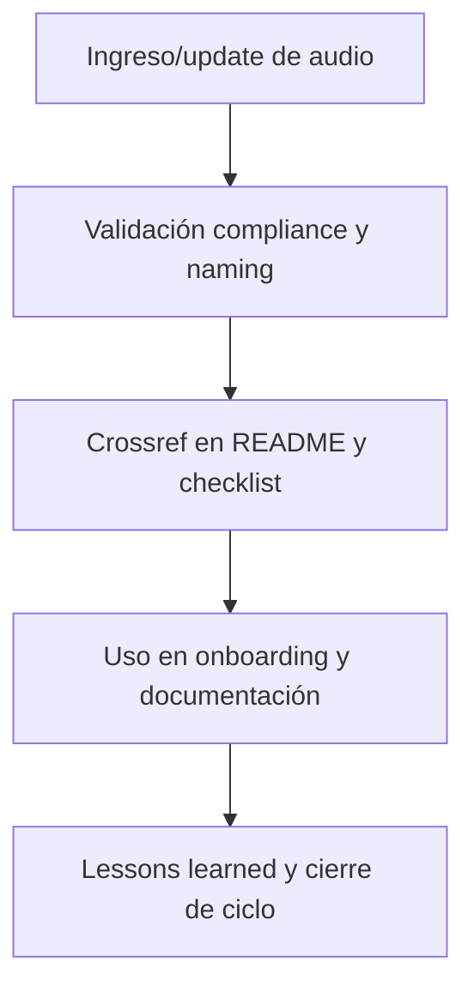

---

file: readme\_core\_doc\_audio\_rw\_b\_v3\_2.md version: v3.2-2025-08-06 status: active role: readme owner: AingZ\_Platform · RwB crossref:

- blueprint\_rw\_b\_platform\_v\_3\_20250803.md
- mpln\_master\_plan\_rw\_b\_v\_3\_20250803.md
- checklist\_root\_rw\_b\_v\_3\_20250805.md
- wf\_pipeline\_creacion\_archivos\_rw\_b\_v\_3\_20250805.md
- ops/templates/template\_readme\_rw\_b\_v3\_1.md changelog:
- 2025-08-06: Consolidación árbol y README audio/ core/doc v3.2, compliance documentación audiovisual.

---

# 🎧 core/doc/audio/ — Documentación de Workflows y Activos en Audio (v3.2)

## 1. Descripción, función, objetivos y contexto

La carpeta `core/doc/audio/` centraliza toda la **documentación en formato audio** vinculada a workflows, procesos, activos y onboarding de la plataforma AingZ/RwB.

### Funciones principales:

- Almacenar audios explicativos, grabaciones de procedimientos, notas de voz y recursos sonoros clave para onboarding y operación.
- Complementar la documentación textual, visual y audiovisual de la plataforma.
- Proveer acceso rápido y trazabilidad a información operativa clave en formatos accesibles.

### Integraciones y sistemas relacionados:

- Referencia cruzada con guías de onboarding (`doc/onbrd/`), documentación visual (`doc/image/`), y workflows de `wf/`.
- Usado en scripts/manuales de onboarding y formación de usuarios IA/humano.

## 2. Estructura interna

| Archivo/Subcarpeta     | Propósito                       | Estado |
| ---------------------- | ------------------------------- | ------ |
| audio\_workflow\_X.wav | Audio explicativo de workflow X | Activo |
| nota\_voz\_onboarding/ | Notas de voz para onboarding    | Activo |
| ...                    | Otros recursos y grabaciones    | Activo |

## 3. Metadatos y compliance

- **Versión:** v3.2 — 2025-08-06
- **Owner/Responsable:** AingZ\_Platform · RwB
- **Crossref obligatoria:** Blueprint, master plan, checklist, template universal README (ops/templates/)
- **Naming/Versionado:** Cumplimiento estricto de políticas RwB v3.2
- **Estado:** Activo

## 4. Ciclo de vida y flujos

## 5. Changelog local

- 2025-08-06: Versión v3.2, compliance documentación audio y onboarding.

## 6. Observaciones / Lessons learned

- Todos los audios deben tener referencia cruzada a los workflows, docs y guías que documentan.
- Mantener la organización, naming y metadatos para trazabilidad y fácil acceso.

---

**FIN README core/doc/audio/ v3.2**

