---

file: readme\_core\_kns\_ctx\_projects\_rw\_b\_v3\_2.md version: v3.2-2025-08-06 status: active role: readme owner: AingZ\_Platform · RwB crossref:

- blueprint\_rw\_b\_platform\_v\_3\_20250803.md
- mpln\_master\_plan\_rw\_b\_v\_3\_20250803.md
- checklist\_root\_rw\_b\_v\_3\_20250805.md
- wf\_pipeline\_creacion\_archivos\_rw\_b\_v\_3\_20250805.md
- ops/templates/template\_readme\_rw\_b\_v3\_1.md changelog:
- 2025-08-06: Consolidación README projects/ ctx v3.2, compliance contexto extendido por proyecto/rama.

---

# 🗂️ core/kns/ctx/projects/ — Contexto Extendido por Proyecto/Rama (v3.2)

## 1. Descripción, función, objetivos y contexto

La carpeta `core/kns/ctx/projects/` almacena **contextos extendidos, configuraciones y preferencias** de cada proyecto/rama de la plataforma AingZ/RwB, asegurando personalización, onboarding y explotación de contexto vivo a nivel micro.

### Funciones principales:

- Registrar configuraciones, contexto operativo y glosario ampliado de cada proyecto/rama.
- Facilitar onboarding incremental, personalización y reporting de contexto vivo específico.
- Servir de input para IA/humano en recuperación y análisis de contexto histórico/actual por proyecto/rama.

### Integraciones y sistemas relacionados:

- Crossref con onboarding, lessons y checkpoints de proyecto (`doc/`, `kns/`, `chkp/`).
- Contexto de proyecto nutre personalización, recuperación de contexto y mejora de experiencia a nivel de rama.

## 2. Estructura interna

| Archivo/Subcarpeta | Propósito                                    | Estado |
| ------------------ | -------------------------------------------- | ------ |
| preferencias\_X/   | Preferencias y configuraciones de proyecto X | Activo |
| glosario\_X.md     | Glosario ampliado de proyecto/rama X         | Activo |
| ...                | Otros contextos específicos                  | Activo |

## 3. Metadatos y compliance

- **Versión:** v3.2 — 2025-08-06
- **Owner/Responsable:** AingZ\_Platform · RwB
- **Crossref obligatoria:** Blueprint, master plan, checklist, template universal README (ops/templates/)
- **Naming/Versionado:** Cumplimiento estricto de políticas RwB v3.2
- **Estado:** Activo

## 4. Ciclo de vida y flujos

```mermaid
graph TD;
  A[Ingreso/update de contexto proyecto/rama] --> B[Validación compliance y naming]
  B --> C[Crossref en README, onboarding y checklist]
  C --> D[Recuperación y explotación por IA/humano]
  D --> E[Lessons learned y cierre de ciclo]
```

## 5. Changelog local

- 2025-08-06: Versión v3.2, compliance contexto extendido proyecto/rama.

## 6. Observaciones / Lessons learned

- Todo cambio de contexto/preferencia de proyecto debe estar versionado y referenciado.
- Mantener onboarding y recuperación de contexto de proyecto/rama sincronizados con lessons y releases de rama.

---

**FIN README core/kns/ctx/projects/ v3.2**

