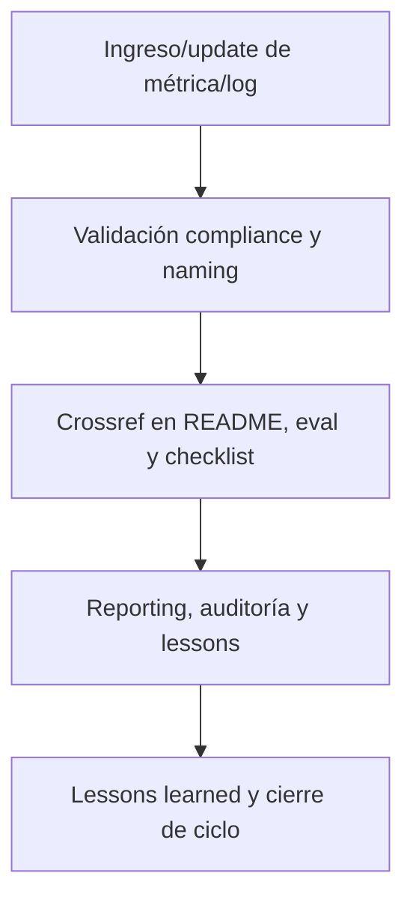

---

file: readme\_core\_kns\_metrics\_rw\_b\_v3\_2.md version: v3.2-2025-08-06 status: active role: readme owner: AingZ\_Platform · RwB crossref:

- blueprint\_rw\_b\_platform\_v\_3\_20250803.md
- mpln\_master\_plan\_rw\_b\_v\_3\_20250803.md
- checklist\_root\_rw\_b\_v\_3\_20250805.md
- wf\_pipeline\_creacion\_archivos\_rw\_b\_v\_3\_20250805.md
- ops/templates/template\_readme\_rw\_b\_v3\_1.md changelog:
- 2025-08-06: Consolidación README metrics/ kns v3.2, compliance métricas de performance y QA.

---

# 📈 core/kns/metrics/ — Métricas de Performance y QA (v3.2)

## 1. Descripción, función, objetivos y contexto

La carpeta `core/kns/metrics/` centraliza **todas las métricas de performance, calidad y validación** asociadas al ciclo de vida de la plataforma AingZ/RwB y sus activos IA/humano.

### Funciones principales:

- Almacenar indicadores clave (KPIs), logs de calidad, métricas de validación y reportes de performance de assets críticos.
- Servir de base para auditoría, reporting, análisis de mejora continua y control de releases.
- Garantizar trazabilidad, replicabilidad y benchmarking incremental de la evolución de la plataforma.

### Integraciones y sistemas relacionados:

- Crossref con eval, lessons, feedback, workflows y auditoría (`ai_learn/`, `wf/`).
- Métricas documentadas nutren reporting, auditoría, releases y toma de decisiones incremental.

## 2. Estructura interna

| Archivo/Subcarpeta | Propósito                            | Estado |
| ------------------ | ------------------------------------ | ------ |
| kpi\_X.md          | Indicador clave de performance (KPI) | Activo |
| reporte\_qa/       | Reportes de calidad y validación     | Activo |
| ...                | Otras métricas y logs de performance | Activo |

## 3. Metadatos y compliance

- **Versión:** v3.2 — 2025-08-06
- **Owner/Responsable:** AingZ\_Platform · RwB
- **Crossref obligatoria:** Blueprint, master plan, checklist, template universal README (ops/templates/)
- **Naming/Versionado:** Cumplimiento estricto de políticas RwB v3.2
- **Estado:** Activo

## 4. Ciclo de vida y flujos

## 5. Changelog local

- 2025-08-06: Versión v3.2, compliance métricas de performance y QA.

## 6. Observaciones / Lessons learned

- Todas las métricas y logs deben estar versionados y trazados para reporting y mejora continua.
- Mantener benchmarking incremental y control cruzado con auditoría, eval y lessons learned.

---

**FIN README core/kns/metrics/ v3.2**

