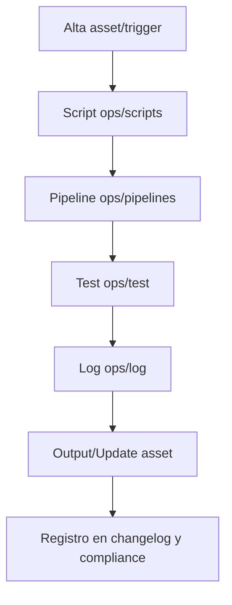

# [RwB] ops/ — README (v4.0)

> **Tagline:** Orquestador operativo: scripts, pipelines, testing, logs y plantillas para automatización y soporte de la plataforma.

---

## Índice
1. [Descripción General](#1-descripción-general)
2. [Estructura Interna](#2-estructura-interna)
3. [Cross‑References](#3-cross-references)
4. [Ciclo de Vida & Workflows](#4-ciclo-de-vida--workflows)
5. [Quick Start / Onboarding](#5-quick-start--onboarding)
6. [Guía para Modelos AI](#6-guía-para-modelos-ai)
7. [Compliance & Governance](#7-compliance--governance)
8. [Changelog](#8-changelog)
9. [Metadatos IA](#9-metadatos-ia)

---

## 1. Descripción General

El bucket `ops/` centraliza todos los recursos de operación y soporte: scripts, logs, pipelines CI/CD, testing y templates reutilizables. Aquí se gestionan los procesos automáticos, validaciones, monitoreo y la trazabilidad técnica del ciclo de vida de assets y workflows de la plataforma.

---

## 2. Estructura Interna

| Path           | Rol         | Descripción breve                                         |
| -------------- | ----------- | -------------------------------------------------------- |
| ./             | Contenedor  | README + metadatos, entrypoint de recursos operativos    |
| scripts/       | Scripts     | Scripts de automatización, procesamiento y mantenimiento |
| log/           | Logs        | Logs y bitácoras automáticas/manuales de operación       |
| pipelines/     | Pipelines   | Definiciones de pipelines CI/CD, testing, onboarding     |
| test/          | Testing     | Pruebas automáticas y matrices de validación             |
| templates/     | Templates   | Plantillas de scripts, logs, reportes, jobs, docs rápidas|

> Actualiza este mapa tras cualquier alta/baja/modificación de asset.

---

## 3. Cross‑References

- **Blueprint v3** → [`blueprint_rw_b_platform_v_3_20250803.md`](../../blueprint_rw_b_platform_v_3_20250803.md)
- **Master Plan v3** → [`mpln_master_plan_rw_b_v_3_20250803.md`](../../mpln_master_plan_rw_b_v_3_20250803.md)
- **Checklist Root v3** → [`checklist_root_rw_b_v_3_20250803.md`](../../checklist_root_rw_b_v_3_20250803.md)
- **Glosario CODE v2** → [`../core/kns/glossary/rw_b_glosario_code_v_2_20250729.md`](../core/kns/glossary/rw_b_glosario_code_v_2_20250729.md)
- **Diccionario CODE_TRIGGERS v2** → [`../core/data/dicts/rw_b_diccionario_code_triggers_v_2_20250729.md`](../core/data/dicts/rw_b_diccionario_code_triggers_v_2_20250729.md)
- **Triggers**: `TRG_AUDIT_LEGACY`, `TRG_CONSOLIDATE_TL`, `TRG_PURGE_AI`

---

## 4. Ciclo de Vida & Workflows



---

## 5. Quick Start / Onboarding

```bash
# 1. Clonar repo raíz con submódulos
$ git clone --recurse-submodules git@github.com:AingZ_Platform/rwb.git

# 2. Navegar a ops/
$ cd ops

# 3. Listar y ejecutar scripts automáticos
$ ls scripts/
$ bash scripts/<script>.sh
```

- **VS Code:** F1 → *Open Workspace* → `workspace_ops.code-workspace`.
- **Obsidian:** Abrir vault en repo raíz, filtrar backlinks a ops/ para ver impacto operativo.

---

## 6. Guía para Modelos AI

- Este README es prompt principal para IA (ChatGPT 4.1, o3, Codex) en automatización, integración y testing.
- **Context Budget:** Máx ≈ 4k tokens; mantener estructura y referencias vivas.
- Scripts y pipelines deben estar referenciados explícitamente aquí para ingesta eficiente por IA y Codex.
- Cada asset generado (log, test, pipeline) debe ser compliant y trazable desde este README.

---

## 7. Compliance & Governance

| Área       | Regla                       | Fuente         |
| ---------- | --------------------------- | -------------- |
| Naming     | `naming_universal_v3`       | Blueprint §2.2 |
| Versionado | SemVer (`v<major>.<minor>`) | Blueprint §1.3 |
| Testing    | *ops/test/*                 | Master Plan §3 |
| Scripts    | *ops/scripts/*              | Blueprint §4   |

- Cambios deben auditarse por triggers activos y logearse en ops/log/.
- Issues de desviación marcar con `non-compliant`.

---

## 8. Changelog

| Fecha      | Versión | Autor      | Cambios                             |
| ---------- | ------- | ---------- | ----------------------------------- |
| 2025-08-05 | v3.1    | ChatGPT 4.1 | README inicial enriquecido nodo ops/|

---

## 9. Metadatos IA
```yaml
bucket: ops
version: v3.1
updated: 2025-08-05
blueprint_ref: ../../blueprint_rw_b_platform_v_3_20250803.md
master_plan_ref: ../../mpln_master_plan_rw_b_v_3_20250803.md
triggers:
  - TRG_AUDIT_LEGACY
  - TRG_CONSOLIDATE_TL
  - TRG_PURGE_AI
```

---

**FIN README ops/ v3.1**

