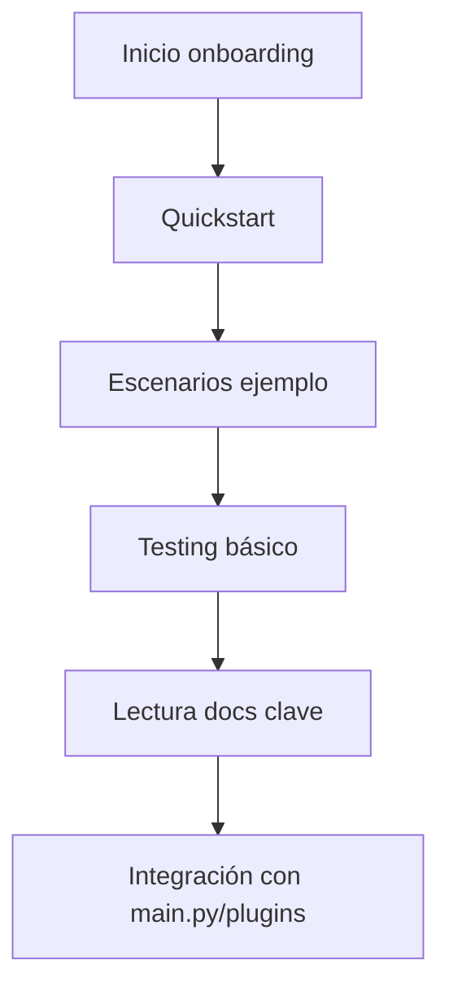

---

## file: README.md version: v3.1-2025-08-05 bucket: packages/vds\_core/onboarding blueprint: ../../../blueprint\_rw\_b\_platform\_v\_3\_20250803.md status: active updated: 2025-08-05 role: documentation owner: AingZ\_Platform · RwB

# [RwB] packages/vds\_core/onboarding/ — README (v3.1)

> **Tagline:** Onboarding rápido, documentación y ejemplos para inicializar, testear y comprender la infraestructura vds\_core y su integración con la plataforma.

---

## Índice

1. [Descripción General](#1-descripción-general)
2. [Estructura Interna](#2-estructura-interna)
3. [Cross‑References](#3-cross-references)
4. [Ciclo de Vida & Workflows](#4-ciclo-de-vida--workflows)
5. [Quick Start / Onboarding](#5-quick-start--onboarding)
6. [Recomendaciones & Lessons Learned](#6-recomendaciones--lessons-learned)
7. [Compliance & Governance](#7-compliance--governance)
8. [Changelog](#8-changelog)
9. [Metadatos IA](#9-metadatos-ia)

---

## 1. Descripción General

Repositorio dedicado a toda la documentación, scripts y ejemplos de onboarding para el core de la plataforma (vds\_core). Aquí se concentran los procedimientos, quickstart, escenarios de prueba y ayudas rápidas para humanos y modelos IA.

> Su propósito es acelerar el ramp-up de nuevos usuarios, auditar flujos y garantizar comprensión completa del ciclo de vida de la plataforma, desde la configuración base hasta la integración de plugins.

---

## 2. Estructura Interna

| Path     | Rol        | Descripción breve                                  |
| -------- | ---------- | -------------------------------------------------- |
| ./       | Contenedor | README + metadatos                                 |
| \*.md    | Docs       | Documentos de onboarding, guías rápidas y flujos   |
| \*.sh    | Scripts    | Scripts de inicialización y ejemplos plug&play     |
| \*.ipynb | Notebooks  | Notebooks de prueba/documentación viva (si aplica) |

---

## 3. Cross‑References

- **Blueprint v3** → [`../../../blueprint_rw_b_platform_v_3_20250803.md`](../../../blueprint_rw_b_platform_v_3_20250803.md)
- **Master Plan v3** → [`../../../mpln_master_plan_rw_b_v_3_20250803.md`](../../../mpln_master_plan_rw_b_v_3_20250803.md)
- **Checklist Root v3** → [`../../../checklist_root_rw_b_v_3_20250803.md`](../../../checklist_root_rw_b_v_3_20250803.md)
- **Core README** → [`../README.md`](../README.md)

---

## 4. Ciclo de Vida & Workflows



---

## 5. Quick Start / Onboarding

```bash
# Navegar a onboarding y listar materiales
$ cd packages/vds_core/onboarding
$ ls *.md *.sh *.ipynb

# Ejecutar ejemplo de onboarding
$ bash onboarding_example.sh
```

> Para usuarios IA: partir desde este README para obtener prompts, ejemplos de estructura y referencias cruzadas.

---

## 6. Recomendaciones & Lessons Learned

- Mantener los ejemplos actualizados cada vez que se modifique la estructura o lógica del core/plugins.
- Todo script, notebook o guía debe indicar fecha y autor.
- Validar que onboarding cubra todo el ciclo de vida desde settings hasta integración de plugins/tests.
- Registrar cualquier incidente o workaround como “lesson learned” para futuro troubleshooting.

---

## 7. Compliance & Governance

| Área       | Regla                 | Fuente         |
| ---------- | --------------------- | -------------- |
| Naming     | `naming_universal_v3` | Blueprint §2.2 |
| Onboarding | Docs/scripts oblig.   | Master Plan §3 |

---

## 8. Changelog

| Fecha      | Versión | Autor       | Cambios                            |
| ---------- | ------- | ----------- | ---------------------------------- |
| 2025-08-05 | v3.1    | ChatGPT 4.1 | README inicial onboarding enriched |

---

## 9. Metadatos IA

```yaml
bucket: packages/vds_core/onboarding
version: v3.1
updated: 2025-08-05
blueprint_ref: ../../../blueprint_rw_b_platform_v_3_20250803.md
master_plan_ref: ../../../mpln_master_plan_rw_b_v_3_20250803.md
triggers:
  - TRG_AUDIT_LEGACY
  - TRG_CONSOLIDATE_TL
  - TRG_PURGE_AI
```

---

**FIN README packages/vds\_core/onboarding/ v3.1**

