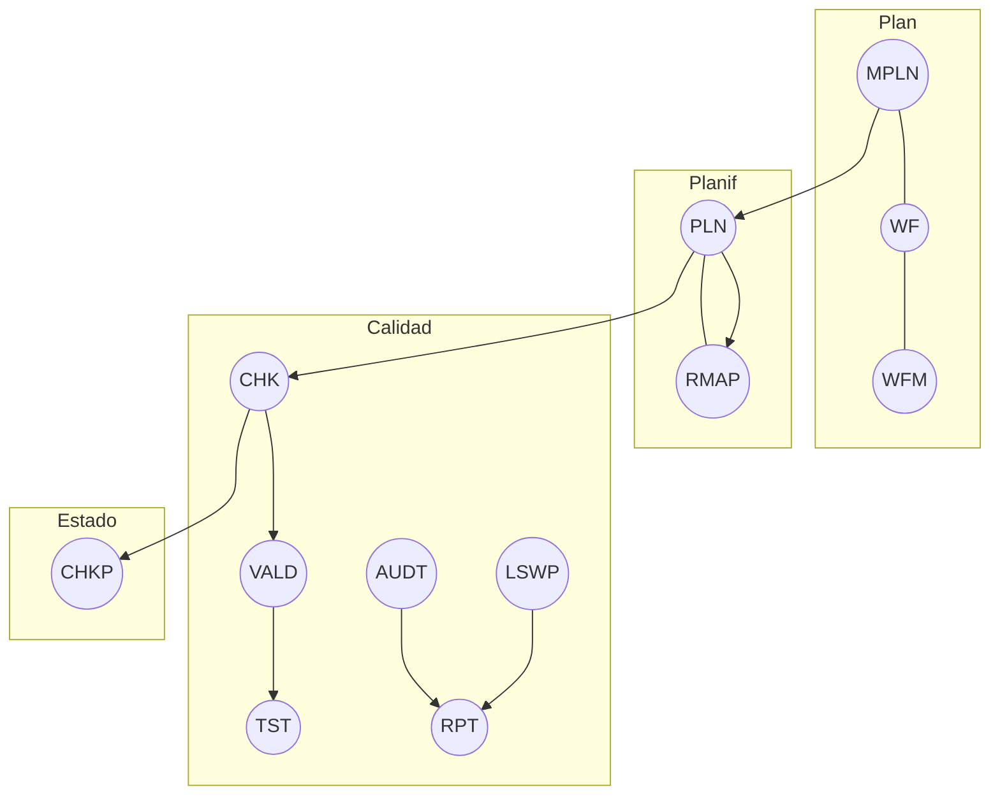

---

## id: aingz\_ruleset\_max name: RULESET\_MAX version: 1.0.0 status: final locked: true owner: AingZ\_Platform · ArchOps scope: universal platforms: [GPT5, CODEX, OPENAI\_API, GH\_BOT, VSC, PY, OBSIDIAN, EXCALIDRAW] connectors: [GitHub, GoogleDrive, SharePoint/OneDrive, Box, Dropbox, Notion, Gmail, Calendar, Contacts] date: 2025-08-31 links: governs: [InstructionPrompt\_RULESET\_Dev\_LDM v1.0.0, FORM\_LDM\_Intake v1.0.0] contract: "Reglas de máxima jerarquía para IA + humanos. Sin rutas duras. Overrides sólo vía SPEC.\*"

# RULESET\_MAX — Normativa universal y plantilla ejecutable (AingZ)

> **Axioma**: contrato antes que implementación. **Una sola semántica** para todos los entornos.

---

## 0) Cabecera obligatoria (rellenar)

```yaml
asset:
  id: <uid>
  name: <PascalCase>
  version: <SemVer>
  owner: AingZ_Platform
  status: draft|working|final
context:
  dom: <Domain>
  goals: [<objetivo1>, <objetivo2>]
  risks: [<riesgo1>, <riesgo2>]
compat:
  platforms: [GPT5, CODEX, OPENAI_API, GH_BOT, VSC, PY, OBSIDIAN, EXCALIDRAW]
  connectors: [GitHub, GoogleDrive]
  notes: "Sin acoplar a rutas. Especificidades en SPEC.*"
```

---

## 1) Principios

1. **Semántica única**: glosario GLOS\_V5. Un término = un concepto.
2. **Contratos claros**: I/O, efectos, límites observables.
3. **Interoperabilidad**: misma semántica en todas las plataformas.
4. **Evidencia**: toda acción deja traza (LOG/BIT/CHG/ADT/VALOG).
5. **Evolución controlada**: `Deprecated: true` + `ReplacedBy`.
6. **Privacidad**: minimización de datos y sin secretos en links.

---

## 2) Estructura

| CODE | Name              | Definición                | Contract                    |
| ---- | ----------------- | ------------------------- | --------------------------- |
| RULE | Ruleset           | Marco normativo universal | Naming/contratos/validación |
| SPEC | SpecificExtension | Overrides acotados        | Ámbito, duración, rollback  |
| ENV  | EnvInstruction    | Ajuste por plataforma     | Parámetros declarativos     |
| PRC  | ProcInstruction   | Procedimiento             | Paso a paso humano/agente   |
| WK   | WorkflowKnowledge | Aprendizaje/logging       | Persistencia post‑run       |
| CHK  | Checklist         | Criterios observables     | QA/aceptación               |
| VALD | Validation        | Verificación técnica      | Pass/Fail + métricas        |
| AUDT | Audit             | Auditoría                 | Evidencias y hallazgos      |
| RPT  | Report            | Síntesis                  | KPIs + evidencias           |

---

## 3) Naming y unicidad

- `CODE` ≤5, **SCREAMING\_SNAKE**; `Name` **PascalCase**.
- `ID` global inmutable. Sin rutas físicas.
- Crossref sólo semántico (alias/tema).

---

## 4) Jerarquía de ejecución



---

## 5) Conectores y feedback

**Regla**: conectores son **fuentes**, no verdad. La verdad = contrato + evidencia.

- **Synced**: usar indexado previo cuando exista.
- **Feedback**: cada uso registra `WK.log`. Consolidar con `TRG_CONSOLIDATE_TL`.
- **Privacidad**: limitar por repos/carpetas; sin secretos en links públicos.
- **Fallas**: usar ruta espejo y registrar `ADT`.

**WK.log (plantilla)**

```yaml
wk_entry:
  when: <iso8601>
  actor: ai|human
  connector: <GitHub|Drive|...>
  query: <texto>
  scope: <repo/carpeta/tag>
  artifacts: [<ids>]
  findings: [<bullet1>, <bullet2>]
  gaps: [<falta1>]
  next: [<acción>]
```

---

## 6) Seguridad y datos

1. Sin compras ni formularios sin confirmación.
2. Minimizar PII. `USC` gobierna visibilidad/acciones.
3. Links compartidos sin datos sensibles.
4. **Backup** antes de cambios; `CHKP` tras release.

---

## 7) ENV — perfiles

### 7.1 GPT5 · ChatGPT

```yaml
ENV.GPT5:
  tools: [browser, agent, deep_research, python, images, canvas]
  connectors_allowed: [GitHub, GoogleDrive]
  projects:
    instructions: |
      Contexto: <dominio>
      Fuentes: <archivos/repos>
      Tareas: <bullets>
      Salida: <JSON/MD>
      Calidad: <tests/métricas>
    memory: project_only: true
  policies: {citations: required_for_web, data_controls: {train_chats:false}}
  outputs: {default_format: markdown_report|json_deliverable}
```

**Checklist**

-

### 7.2 CODEX

```yaml
ENV.CODEX:
  cli: {config: ~/.codex/config.toml, env: {inherit:"all", exclude:["AWS_*","AZURE_*"], set:{PROJECT:"AingZ"}}}
  guardrails: {network: sandbox_default_off, confirm_before_apply: true}
  workflows:
    - {name: bugfix_batch, steps: [plan, diff, test, pr]}
    - {name: feature_small, steps: [spec, scaffold, diff, test, pr]}
```

**Checklist**

-

### 7.3 OPENAI\_API

```yaml
ENV.OPENAI_API:
  model: gpt-5-think|auto
  tools: [web_browser, python, actions]
  json_schemas: [Deliverable]
  retries: {max:2, backoff: exponential}
```

### 7.4 GH\_BOT

```yaml
ENV.GH_BOT:
  repos: [<org/repo>]
  actions: [label_by_CODE, comment_chk, open_pr_on_diff]
  rules: {pr_requirements: [tests_green, checklist_attached, no_secrets]}
```

### 7.5 VSC

```yaml
ENV.VSC:
  integration: work_with_apps
  policies: {show_diff: true, dry_run_default: true}
  tasks: [refactor, tests, docs_sync]
```

### 7.6 PY

```yaml
ENV.PY:
  outputs: [table, chart, html]
  rules: {exit_codes: true, reproducible: true}
```

### 7.7 OBSIDIAN

```yaml
ENV.OBSIDIAN:
  vault: <ruta_logica>
  sync: {via: GitHub|Drive}
  taxonomy:
    folders: [/Brainstorm, /Research, /Design, /Decisions, /Archive]
    tags: [#idea, #insight, #decision, #retro, #diagram]
  note_template: |
    # Título
    Fecha: {{date:YYYY-MM-DD}}
    Estado: draft
    Objetivo:
    Hallazgos:
    Próximos pasos:
```

### 7.8 EXCALIDRAW

```yaml
ENV.EXCALIDRAW:
  storage: in_vault
  formats: [.excalidraw, .svg, .png]
  pipeline:
    - {source: mermaid, action: export_to_excalidraw}
    - {source: excalidraw, action: export_png_svg_and_link_note}
```

---

## 8) SPEC — overrides (plantilla)

```yaml
SPEC.<ctx>:
  scope: <repo|carpeta|proyecto>
  duration: <YYYY-MM-DD>.. <YYYY-MM-DD|open>
  overrides:
    ENV.GPT5.connectors_allowed: [GitHub]
    ENV.CODEX.workflows[feature_small].steps: [spec, scaffold, review, diff, test, pr]
  rollback: <procedimiento>
  rationale: <por qué>
```

---

## 9) Procedimientos (PRC)

1. **Arranque**: `MPLN` y `PLN` con objetivos/criterios.
2. **Operación**: `WF` con `CHK` por etapa.
3. **Control**: `VALD/TST` por componente; `AUDT` por release.
4. **Cierre**: `RPT` + `CHKP` congelado.

**Checklist de release**

-

---

## 10) Plantillas de salida

### 10.1 Reporte MD

```md
# Resumen (≤10 bullets)
## Hallazgos con citas
## Contrastes y consenso
## Riesgos y vacíos
## Metodología
## Anexos (fuentes, enlaces, datasets)
```

### 10.2 JSON Deliverable

```json
{"$schema":"https://json-schema.org/draft/2020-12/schema","title":"Deliverable","type":"object","properties":{"summary":{"type":"string"},"insights":{"type":"array","items":{"type":"string"}},"actions":{"type":"array","items":{"type":"string"}},"risks":{"type":"array","items":{"type":"string"}},"sources":{"type":"array","items":{"type":"string"}}},"required":["summary","sources"]}
```

---

## 11) Auditoría y triggers

- `TRG_AUDIT_TL`: auditoría de timeline.
- `TRG_CONSOLIDATE_TL`: consolidación post‑hito.
- `TRG_PURGE_AI`: purga de datos IA.

**VALM mínima**

```yaml
VALM:
  criteria:
    - {id: citations_web, rule: "Todo punto no trivial referenciado", metric: coverage_pct, target: ">= 0.9"}
    - {id: tests_green, rule: "TSTSC all green", metric: pass_rate, target: 1.0}
```

---

## 12) 2º cerebro (Obsidian)

- Brainstorm → Research → Decisions.
- Cada diagrama Excalidraw enlaza su nota madre y viceversa.
- `WK` por sesión; semanal: consolidar a `LEARN`.

---

## 13) Anexos

### 13.1 Action (ejemplo)

```json
{"type":"function","function":{"name":"create_ticket","description":"Crea un ticket en Jira","parameters":{"type":"object","properties":{"title":{"type":"string"},"projectKey":{"type":"string"},"priority":{"type":"string","enum":["Low","Medium","High"]}},"required":["title","projectKey"]}}}
```

### 13.2 OpenAPI (lectura)

```yaml
openapi: 3.1.0
info: {title: GitHub Reader, version: 1.0.0}
servers: [{url: https://api.github.com}]
paths:
  /repos/{owner}/{repo}/pulls:
    get:
      operationId: listPulls
      parameters:
        - {name: owner, in: path, required: true, schema: {type: string}}
        - {name: repo, in: path, required: true, schema: {type: string}}
        - {name: state, in: query, schema: {type: string, enum: [open, closed, all]}}
      responses: {'200': {description: OK}}
```

---

## 14) OutputTemplate

```yaml
output_example:
  status: FINAL
  id_asset: ruleset_max
  generated_by: ai
  created_at: 2025-08-31T00:00:00-03:00
  params: [scope: universal, coupling: none]
  result:
    - sections: [principios, envs, procedimientos, auditoria]
  log: [step1: scaffold_ruleset_max, step2: fill_envs, step3: run_audit]
```

