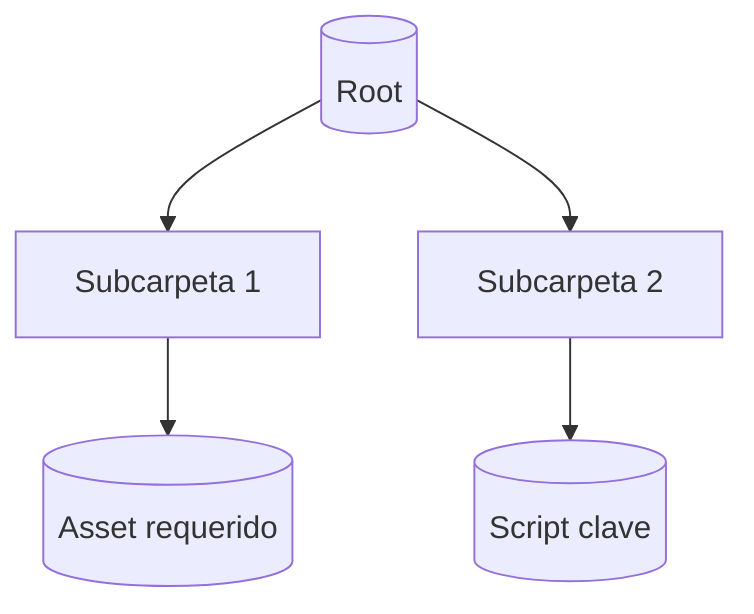

# [[Formulario · Dir Tree Creator]]

> [!summary] Navegación rápida
> [[#00 · Setup]] · [[#10 · Horizonte & Alcance]] · [[#20 · Mermaid Blueprint]] · [[#30 · Excalidraw Sync]] · [[#40 · Assets por Carpeta]] · [[#50 · Validación & Checks]] · [[#60 · KPIs & Auditoría]] · [[#70 · WK.log & Feedback]]

---

## 00 · Setup

```button
name 🧭 Abrir dir tree existente en Excalidraw
type command
action Excalidraw:Open drawing
color orange
```

```button
name ✳️ Generar blueprint base Mermaid
type command
action QuickAdd:DirTree · Mermaid Blueprint
color teal
```

```button
name ♻️ Refrescar paneles
type command
action Dataview:Refresh current view
color purple
```

- [ ] Confirmar ruta raíz del árbol: ` `
- [ ] Definir repositorios afectados: ` `
- [ ] Registrar stakeholders técnicos en [[#40 · Assets por Carpeta]].

> [!hint] Ajusta los nombres de comandos `QuickAdd` y `Excalidraw` según tu vault.

---

## 10 · Horizonte & Alcance

| Elemento | Detalle | Estado |
| --- | --- | --- |
| Propósito del árbol |  | - [ ] |
| Alcance temporal |  | - [ ] |
| Entornos implicados |  | - [ ] |
| Dependencias críticas |  | - [ ] |

> [!faq]- Preguntas guía
> - ¿Qué equipos consumen este árbol?
> - ¿Qué normas o baselines condicionan su estructura?
> - ¿Cómo se coordinan Codex/GPT5 con revisores humanos?

---

## 20 · Mermaid Blueprint



- [ ] Actualizar el diagrama anterior con la estructura real.
- [ ] Documentar convenciones de nomenclatura bajo el diagrama.

> [!tip] Duplica este bloque al versionar cambios significativos para mantener trazabilidad histórica.

---

## 30 · Excalidraw Sync

> [!info] Enlaza el lienzo activo para edición colaborativa.

![[<% tp.file.title %>.excalidraw]]

- [ ] Sincronizar capas de Excalidraw con los nodos de Mermaid.
- [ ] Añadir sticky notes con owners y SLAs por carpeta.
- [ ] Exportar PNG/SVG y adjuntarlo en `attachments/` si se comparte externamente.

---

## 40 · Assets por Carpeta

> [!todo]+ Matriz de requisitos
> Lista cada carpeta con sus assets obligatorios, responsables y estado.

| Carpeta | Asset requerido | Responsable | Estado | Notas |
| --- | --- | --- | --- | --- |
|  |  |  | - [ ] |  |
|  |  |  | - [ ] |  |
|  |  |  | - [ ] |  |

```tasks
not done
path includes "<ruta raíz>"
description includes "asset"
```

> [!warning] Mantén consistentes las etiquetas (`#dir-tree`, `#asset-mandatory`) para reportes automáticos.

---

## 50 · Validación & Checks

- [ ] Cada carpeta tiene owner y plan de respaldo documentado.
- [ ] Existe estrategia de versionado para scripts sensibles.
- [ ] Las dependencias cruzadas están registradas en `README` locales.
- [ ] Se notificó a Codex/GPT5 sobre cambios relevantes.

```tracker
searchType: task
searchTarget: "#dir-tree"
startDate: 2024-01-01
endDate: 2024-12-31
summary:
  template: "Checks completados: {{count}}"
```

---

## 60 · KPIs & Auditoría

| KPI | Fórmula | Meta | Valor actual |
| --- | --- | --- | --- |
| TreeCompleteness | (# carpetas documentadas / # carpetas totales) | 100% |  |
| AssetAssignmentRate | (# assets con owner / # assets totales) | 95% |  |
| ReviewCycleTime | (fecha última revisión - fecha previa) | <= 14 días |  |

```dataview
TABLE file.link AS "Formulario", asset_status
FROM "templates/architecture_interactive_forms"
WHERE asset_type = "dir_tree_form" and file.name != this.file.name
SORT file.mtime desc
LIMIT 15
```

> [!note] Usa `asset_status` = `in_review`, `approved` o `deprecated` para facilitar los tableros.

---

## 70 · WK.log & Feedback

- 📅 <% tp.date.now("YYYY-MM-DD HH:mm") %> · Responsable:  · Resumen:
- 📅  · Responsable:  · Resumen:
- 📅  · Responsable:  · Resumen:

> [!tip] Etiqueta entradas relevantes con `#dir-tree-log` y enlaza decisiones clave al Legacy correspondiente.

---

> [!done] Al finalizar, actualiza `asset_status` a `approved` y archiva una copia inmutable del Mermaid y Excalidraw asociados.
