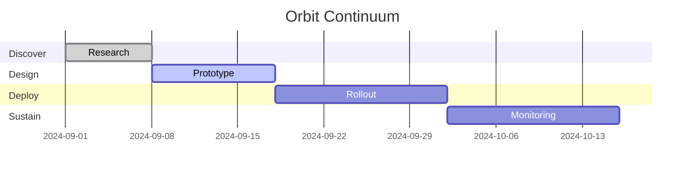

# [[Orbit Continuum Template · Ciclo Vivo]]

> [!summary] Flujo de navegación
> [[#00 · Setup]] · [[#05 · Orbit Stage Map]] · [[#10 · Discover]] · [[#20 · Design]] · [[#30 · Deploy]] · [[#40 · Sustain]] · [[#50 · KPI Orbit]] · [[#60 · Feedback Loop]]

---

## 00 · Setup

```button
name ⚙️ Crear Stage Note
type command
action QuickAdd:Orbit · Nueva Stage Note
color teal
```

```button
name 🧭 Abrir Canvas Orbit
type command
action Canvas:Open
color orange
```

- [ ] Definir scope del ciclo actual.
- [ ] Confirmar stakeholders y responsables.
- [ ] Revisar reglas aplicables en [[ruleset/ruleset_master_v_1]].

---

## 05 · Orbit Stage Map



- [ ] Actualizar fechas según planificación real.
- [ ] Documentar dependencias críticas en comentarios.

---

## 10 · Discover

| Actividad | Responsable | Evidencia | Estado |
| --- | --- | --- | --- |
|  |  |  | - [ ] |
|  |  |  | - [ ] |

```tasks
not done
path includes "discover"
```

> [!note] Adjunta descubrimientos clave en `legacy_reference_pool/` o en evidencias locales.

---

## 20 · Design

> [!todo]+ Artefactos esenciales
> - [ ] Wireframes actualizados en Excalidraw: `![[<% tp.file.title %>_design.excalidraw]]`
> - [ ] Documentación técnica en `/design/`
> - [ ] Revisión de accesibilidad completada

```dataview
TABLE file.link AS "Asset", file.mtime AS "Actualizado"
FROM ""
WHERE contains(file.name, "design")
SORT file.mtime desc
LIMIT 6
```

---

## 30 · Deploy

| Item | Owner | Script/Automation | Estado |
| --- | --- | --- | --- |
|  |  |  | - [ ] |
|  |  |  | - [ ] |

```tasks
not done
path includes "deploy"
```

> [!warning] Verifica pipelines CI/CD antes de marcar como completado.

---

## 40 · Sustain

- [ ] Implementar monitoreo (Grafana/Prometheus).
- [ ] Ejecutar evaluación de emisiones/energía.
- [ ] Planificar retroalimentación de usuarios.

```tracker
searchType: task
searchTarget: "#orbit-sustain"
startDate: 2024-01-01
endDate: 2024-12-31
summary:
  template: "Acciones Sustain completadas: {{count}}"
```

---

## 50 · KPI Orbit

| KPI | Fórmula | Meta | Valor | Observaciones |
| --- | --- | --- | --- | --- |
| StageOnTime | (# stages on-time / total stages) | 95% |  |  |
| FeedbackLoopTime | (fecha feedback - fecha deploy) | <= 7 días |  |  |
| SustainabilityScore | (puntuación agregada auditoría) | >= 85 |  |  |

```dataview
TABLE file.link AS "Stage", asset_status
FROM "templates/master_template_proposals/next_gen_master_templates"
WHERE asset_type = "master_template_proposal" and contains(asset_tags, "orbit")
LIMIT 5
```

---

## 60 · Feedback Loop

- 📅 <% tp.date.now("YYYY-MM-DD HH:mm") %> · Stage:  · Lección:
- 📅  · Stage:  · Lección:

```tasks
not done
description includes "retro"
```

> [!done] Al cierre del ciclo, actualizar `asset_status` y enviar resumen al Legacy correspondiente.
