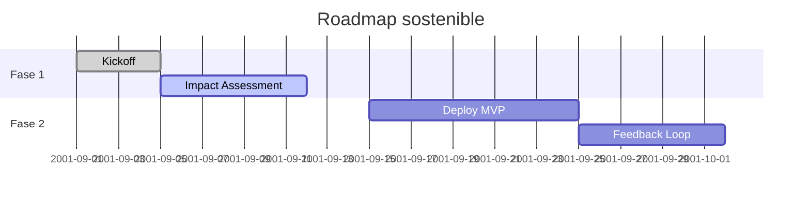

---
asset:
  id: obsidian_master_template_nexus_2025_09
  name: ObsidianMasterTemplateNexus
  version: 0.1.1
  owner: AingZ_Platform
  status: draft
context:
  dom: IntegratedOps
  goals:
    - unify_strategy_execution_logging
    - maximize_obsidian_interactivity
  risks:
    - plugin_incompatibility
    - overload_information_density
compat:
  platforms: [Obsidian, GPT5, CODEX]
  connectors: [GitHub, GoogleDrive]
  notes: "Pensado para vaults sincronizados con agentes IA."
obsidian:
  cssclass: tabs
  required_plugins: [Dataview, Buttons, Tracker, Calendar, Excalidraw, Templater]
  recommended_themes: [Minimal, ITS]
---

# <% tp.file.title %>

> [!info] Resumen ejecutivo
> - **Propósito**: <descripción breve>
> - **North Star KPI**: `<kpi_principal>`
> - **Estado actual**: `[[StatusBoard]]` | <% tp.date.now("YYYY-MM-DD") %>
> - **Owner**: `@persona`

---

%% --- TAB 1: Estrategia --- %%

## Estrategia · <% tp.date.now("YYYY") %> T<% tp.date.now("Q") %>

> [!abstract] Objetivos clave
> - O1 — <outcome>
> - O2 — <outcome>
> - O3 — <outcome>

### Hipótesis y principios
- **Hipótesis central** :: <texto>
- **Principio de sostenibilidad** :: <texto>
- **Riesgos críticos** :: <riesgo 1>, <riesgo 2>

```dataview
TABLE status as "Estado", impact_carbon as "Impacto CO₂", next_review as "Próxima revisión"
FROM ""
WHERE contains(tags, "initiative") and file.folder = this.file.folder
SORT next_review asc
```

> [!tldr] Decisiones tomadas
> 1. <Decisión clave>
> 2. <Decisión clave>
> 3. <Decisión clave>

---

%% --- TAB 2: Plan + Backlog --- %%

## Plan operativo

> [!todo] Backlog priorizado
> - [ ] `#task/high` <acción 1>
> - [ ] `#task/med` <acción 2>
> - [ ] `#task/low` <acción 3>

```dataviewjs
const tasks = dv.pages().file.tasks
  .where(t => !t.completed && t.path.includes(dv.current().file.folder));
const grouped = dv.groupBy(tasks, t => t.tags.find(tag => tag.startsWith("#task/")) ?? "#task/none");
dv.table(["Etiqueta", "Pendientes"], grouped.map(g => [g.key, g.rows.length]));
```

### Roadmap visual



> [!tip]- Plantillas rápidas (Buttons)
> ^buttons-nexus
> ```button
> name Nueva bitácora diaria
> type command
> action Templater: Create new note from template
> templater_template Daily/DailyLog
> ```
>
> ```button
> name Registrar feedback
> type append
> action ## Feedback\n- {{DATE:YYYY-MM-DD}} — <actor>: <resumen>
> ```

---

%% --- TAB 3: Métricas + Impacto --- %%

## Panel de métricas

```dataview
TABLE WITHOUT ID date as "Fecha", metric, value, unit, trend
FROM ""
WHERE type = "metric" and project = this.file.name
SORT date desc
LIMIT 10
```

> [!quote] Manifiesto de impacto
> "Cada decisión debe reducir la huella ambiental sin comprometer la autonomía tecnológica."

### Tracker de sostenibilidad

```tracker
searchType: frontmatter
searchTarget: impact_carbon
datasetName: Impacto CO2
line:
    title: "Kg CO₂ eq"
    showPoints: true
    cumulative: false
```

### Bitácora WK.log

> [!note]- Registro continuo
> ```yaml
> wk_entry:
>   when: <% tp.date.now("YYYY-MM-DDTHH:mm") %>
>   actor: ai|human
>   scope: <área>
>   findings:
>     - <insight>
>   gaps:
>     - <pendiente>
>   next:
>     - <acción>
> ```

---

%% --- TAB 4: Referencias --- %%

## Repositorios & Artefactos
- [[ruleset/ruleset_master_v_1|Ruleset maestro]]
- [[core/doc/workbench/AINGZ_V5_Baselines_Unificados_v1_4_1_locked|Baseline V5]]
- [[kb_obsidian_plugins_core_community_unificado_v_2025_09_02|Plugins Obsidian]]

> [!example]- Canvas & Excalidraw
> - Canvas principal: `![[<% tp.file.title %>.canvas]]`
> - Excalidraw: `![[<% tp.file.title %>_diagram.excalidraw]]`

> [!faq]- Preguntas rápidas
> 1. **¿Cuál es el próximo hito?** → Revisa `next_review` en Dataview.
> 2. **¿Qué decisiones requieren confirmación?** → Callout *Decisiones tomadas*.
> 3. **¿Cómo registrar feedback?** → Botón *Registrar feedback* o sección `WK.log`.

---

%% --- Footer --- %%

```yaml
OutputTemplate:
  deliverable: MasterNote
  formats: [markdown, json]
  validation:
    - check: Linter
    - check: Dataview refresh
  next_review: <% tp.date.now("YYYY-MM-DD", 7) %>
```
